# Core Workflows

This section documents the critical user journeys through sequence diagrams, showing interactions between frontend components, backend services, agents, and external integrations. These workflows reflect the PRD requirements and demonstrate how the architecture handles real-world scenarios.

## 1. Doctor-Initiated Patient Onboarding Flow

**Purpose:** Enables doctor-referred patient onboarding with automatic revenue sharing setup (FR35, FR36).

**Key Requirements:**
- Doctor generates unique QR code for patient onboarding
- Patient scans QR code during sign-up
- System automatically creates DoctorPatientConnection with correct revenue share percentage (30% referring doctor, 60% diabetes specialist)
- 1-month free trial activated for referred patients
- Doctor notified when patient completes onboarding

## 2. Glucose Logging with Multiple Input Methods

**Purpose:** Supports 4 input methods (manual, OCR photo, voice, Bluetooth) with offline-first architecture and emergency detection (FR1, FR7, FR16, FR17).

**Key Requirements:**
- Offline-first: Save locally first, sync when online
- Time verification for accurate timestamp collection
- Emergency detection for hypoglycemia (<70 mg/dL) and hyperglycemia (>300 mg/dL)
- Caregiver escalation based on management mode

## 3. Emergency Detection & Response Flow

**Purpose:** Detects and responds to hypoglycemia/hyperglycemia emergencies with escalation to caregivers and doctors (FR7, FR8).

**Key Requirements:**
- Immediate detection on glucose logging
- AI-generated safety instructions (OpenRouter GPT-4)
- Escalation based on management mode
- 15-minute follow-up timer with re-escalation if no new reading
- Doctor alert in "Urgent Attention" bucket

```mermaid
sequenceDiagram
    participant P as Patient Mobile App
    participant API as API Gateway
    participant CM as Clinical Monitor Agent
    participant OR as OpenRouter API
    participant EE as Engagement Engine
    participant DB as PostgreSQL
    participant WA as Evolution API
    participant C as Caregiver Dashboard
    participant D as Doctor Dashboard

    P->>API: glucose.logReading(value: 55 mg/dL)
    API->>DB: Store glucose reading
    API->>CM: Emit clinical.glucose.check

    CM->>DB: Fetch patient thresholds
    Note over CM: Hypoglycemia: < 70 mg/dL<br/>Hyperglycemia: > 300 mg/dL

    CM->>CM: Detect HYPOGLYCEMIA
    CM->>DB: Log emergency event

    CM->>OR: Generate immediate instructions
    Note over OR: Model: GPT-4 Turbo<br/>Prompt: "Patient glucose 55 mg/dL,<br/>provide immediate safety steps"
    OR-->>CM: { instructions: "1. Drink juice...<br/>2. Recheck in 15 min...<br/>3. Call emergency if..." }

    CM->>EE: Emit patient.emergency.detected<br/>{ type: HYPOGLYCEMIA, value: 55, instructions }

    EE->>DB: Fetch patient management mode

    alt Management Mode: PATIENT_PRIMARY
        EE->>P: Push notification (CRITICAL)
        Note over P: "⚠️ URGENT: Low Blood Sugar<br/>Follow these steps immediately"
        EE->>WA: WhatsApp message (instructions)
    else Management Mode: SHARED
        EE->>P: Push notification (CRITICAL)
        EE->>C: Alert caregiver (CRITICAL)
        Note over C: "⚠️ Parent's blood sugar is 55<br/>Contact them immediately"
    else Management Mode: CAREGIVER_PRIMARY
        EE->>C: Alert caregiver (CRITICAL + Call action)
        Note over C: "⚠️ CALL NOW: Blood sugar 55"
        EE->>P: Push notification (secondary)
    end

    EE->>DB: Fetch connected doctors
    EE->>D: Create doctor alert (URGENT bucket)
    Note over D: Alert appears in doctor's<br/>"Urgent Attention" bucket

    EE->>DB: Log notification (count towards FR15)

    CM->>CM: Start 15-minute follow-up timer

    Note over CM: Wait 15 minutes...

    CM->>DB: Check for new glucose reading

    alt No New Reading in 15 Minutes
        CM->>EE: Emit patient.emergency.escalation
        EE->>C: Escalate to caregiver (CALL NOW)
        EE->>D: Update doctor alert (CRITICAL)
        EE->>P: Push notification (secondary reminder)
    else New Reading Logged
        CM->>DB: Fetch new glucose value

        alt Still Low (< 70 mg/dL)
            CM->>EE: Emit patient.emergency.persistent
            EE->>C: Escalate (CALL EMERGENCY)
            EE->>D: Update doctor alert (CRITICAL)
        else Recovered (>= 70 mg/dL)
            CM->>EE: Emit patient.emergency.resolved
            EE->>C: Send resolution notification
            EE->>D: Update doctor alert (RESOLVED)
            EE->>P: Confirmation message
        end
    end
```

## 4. Medication Reminder & Escalation Flow

**Purpose:** Sends medication reminders with escalation for missed doses, tracking adherence and alerting doctors for critical non-adherence (FR11, FR12).

**Key Requirements:**
- Cron-based medication reminders at scheduled times
- 30-minute grace period before marking late
- 2-hour escalation to caregiver for missed doses
- Doctor alert if adherence drops below 70% (30 days)
- Rate limiting (FR15: max 5 notifications/day)

## 5. Doctor Reviewing Patient Status (Tiered Dashboard)

**Purpose:** Enables doctors to review patient status efficiently using tiered bucket system (NFR4: 10-15 min daily review target).

**Key Requirements:**
- 4 buckets: Urgent Attention, Needs Attention, Stable, Call In (no data 7+ days)
- Urgent patients prioritized (emergency events last 24h)
- AI-generated patient summary for quick review
- Quick actions: send message, mark reviewed, request tests
- Cached health scores for fast dashboard load (NFR2: <500ms)

## 6. Pre-Meal Warning Intervention (Pattern-Based)

**Purpose:** Provides proactive pre-meal warnings based on detected food-glucose patterns (FR6, FR5).

**Key Requirements:**
- Pattern detection after 4+ weeks data (8+ meal samples)
- Confidence threshold >0.7 before activating warnings
- Warning delivered within 30 seconds of meal logging (before eating)
- Food swap recommendations with better alternatives
- Pattern updates after each post-meal glucose reading

```mermaid
sequenceDiagram
    participant P as Patient Mobile App
    participant API as API Gateway
    participant LC as Lifestyle Coach Agent
    participant HI as Health Insights Agent
    participant DB as PostgreSQL
    participant OR as OpenRouter API
    participant EE as Engagement Engine
    participant WA as Evolution API

    Note over P: User opens meal logging screen<br/>before lunch

    P->>P: Camera opens, captures meal photo
    P->>API: Upload photo to MinIO
    API-->>P: { photoUrl }

    P->>API: meal.logMeal(photoUrl, mealType: LUNCH)
    API->>DB: Create Meal record (isSynced: false)
    API->>LC: Emit lifestyle.meal.logged

    LC->>OR: Analyze meal photo (GPT-4 Vision)
    Note over OR: Prompt: "Identify food items<br/>in this image (Indian cuisine)"
    OR-->>LC: {<br/>  recognizedFoods: ['white rice', 'dal', 'potato curry'],<br/>  estimatedCalories: 550<br/>}

    LC->>DB: Update Meal with recognized foods

    LC->>HI: Request patterns for recognized foods
    HI->>DB: SELECT patterns<br/>WHERE foodItem IN ('white rice', 'potato curry')<br/>AND confidence > 0.7

    DB-->>HI: [<br/>  Pattern {<br/>    foodItem: 'white rice',<br/>    avgGlucoseIncrease: +55 mg/dL,<br/>    betterAlternative: 'brown rice (+25 mg/dL)',<br/>    confidence: 0.85,<br/>    sampleSize: 12<br/>  },<br/>  Pattern {<br/>    foodItem: 'potato curry',<br/>    avgGlucoseIncrease: +45 mg/dL,<br/>    betterAlternative: 'green beans (+15 mg/dL)',<br/>    confidence: 0.78,<br/>    sampleSize: 8<br/>  }<br/>]

    alt Patterns Found (FR6: Pre-meal Warning)
        HI->>HI: Generate pre-meal warning message
        HI->>EE: Emit patient.warning.pre_meal

        EE->>DB: Check notification count (FR15)

        alt Notification Count < 5
            EE->>P: Push notification (within 30 seconds)
            Note over P: "⚠️ Heads up!<br/><br/>Based on your history:<br/>• White rice raises your glucose<br/>  by +55 mg/dL on average<br/>• Try brown rice instead (+25 mg/dL)<br/><br/>• Potato curry: +45 mg/dL<br/>• Try green beans: +15 mg/dL"

            EE->>WA: WhatsApp message (if preferred)
            EE->>DB: Increment notification count

            P->>P: Show warning in app
            P->>P: User can view full pattern details

            alt User clicks "View Better Options"
                P->>API: pattern.getAlternatives(foodItems)
                API->>HI: Request food alternatives
                HI->>OR: Generate alternatives (GPT-4)
                Note over OR: "Suggest 3 alternatives to<br/>white rice + potato curry<br/>for diabetes management"
                OR-->>HI: [<br/>  'Brown rice + green beans',<br/>  'Quinoa + chickpea curry',<br/>  'Roti + mixed vegetables'<br/>]
                API-->>P: { alternatives }
                P->>P: Display alternatives list
            else User ignores warning
                Note over P: User proceeds with meal
            end
        else Notification Count >= 5
            Note over EE: Skip warning (rate limit)<br/>Log for later review
        end
    else No Patterns Found (< 4 weeks data)
        Note over HI: Not enough data<br/>Continue collecting
        HI->>DB: Log meal for future analysis
    end

    Note over P: After meal (2 hours later)...

    P->>API: glucose.logReading(value: 178, state: AFTER_LUNCH)
    API->>DB: Store glucose reading
    API->>HI: Emit insights.pattern.update

    HI->>DB: Fetch last meal before this reading
    HI->>DB: Calculate glucoseImpact<br/>(178 - beforeMealReading)
    HI->>DB: Update Meal.glucoseImpact

    HI->>HI: Update food-glucose correlation<br/>for 'white rice' pattern
    Note over HI: After 4+ weeks (8+ samples),<br/>confidence threshold reached → activate pattern
```

## 7. Caregiver Monitoring & Alert Response

**Purpose:** Enables caregivers to monitor patient health with peace-of-mind dashboard and respond to critical alerts (FR13, FR14).

**Key Requirements:**
- Peace-of-mind dashboard (green/red status cards)
- Critical alert escalation with phone call buttons
- Proxy logging for caregiver-primary mode
- Daily digest summary (8 PM every day)
- Emergency resolution tracking

```mermaid
sequenceDiagram
    participant C as Caregiver Dashboard
    participant API as API Gateway
    participant DB as PostgreSQL
    participant EE as Engagement Engine
    participant CM as Clinical Monitor Agent
    participant P as Patient Mobile App
    participant WA as Evolution API
    participant D as Doctor Dashboard

    Note over C: Caregiver logs in (web or mobile)

    C->>API: caregiver.getDashboard()
    API->>DB: SELECT patients<br/>WHERE caregiverId = X
    API->>DB: Fetch patient health summaries (cached)

    API-->>C: {<br/>  patients: [<br/>    {<br/>      id, name,<br/>      lastGlucose: 128 mg/dL,<br/>      lastReadingAt: 2 hours ago,<br/>      medicationAdherence: 92%,<br/>      emergencyAlerts: 0,<br/>      status: STABLE<br/>    }<br/>  ],<br/>  criticalAlerts: []<br/>}

    C->>C: Display patient status cards
    Note over C: Peace-of-mind dashboard<br/>Green cards = all good<br/>Red cards = critical alerts

    Note over P: Meanwhile... Patient logs low glucose

    P->>API: glucose.logReading(value: 58 mg/dL)
    API->>CM: Emit clinical.glucose.check
    CM->>CM: Detect HYPOGLYCEMIA
    CM->>EE: Emit patient.emergency.detected

    EE->>DB: Fetch patient management mode
    Note over DB: managementMode: SHARED

    EE->>C: Push notification (CRITICAL)
    Note over C: Phone vibrates + alarm sound
    C->>C: Show critical alert banner
    Note over C: "🚨 URGENT: Parent's blood<br/>sugar is 58 mg/dL"

    EE->>WA: WhatsApp alert
    Note over WA: Message to caregiver's WhatsApp<br/>"⚠️ URGENT: Blood sugar alert<br/>58 mg/dL - Call parent now"

    C->>C: Caregiver clicks alert
    C->>API: caregiver.getAlertDetail(alertId)
    API->>DB: Fetch alert + patient current status

    API-->>C: {<br/>  alert: {<br/>    type: HYPOGLYCEMIA,<br/>    value: 58 mg/dL,<br/>    timestamp: 2 min ago,<br/>    instructions: "1. Call patient...<br/>                   2. Ensure they drink juice..."<br/>  },<br/>  patientStatus: {<br/>    lastLocation: "Home",<br/>    recentReadings: [65, 72, 58],<br/>    isResponding: unknown<br/>  }<br/>}

    C->>C: Display alert detail screen
    Note over C: Big buttons:<br/>1. CALL PATIENT (phone icon)<br/>2. I'M WITH PATIENT<br/>3. MARK AS RESOLVED

    alt Caregiver clicks "CALL PATIENT"
        C->>C: Initiate phone call
        Note over C: System opens phone dialer
        C->>API: caregiver.logAction(alertId, "CALLED")
        API->>DB: Log caregiver action
    else Caregiver clicks "I'M WITH PATIENT"
        C->>API: caregiver.updateAlertStatus(alertId, "CAREGIVER_PRESENT")
        API->>DB: Update alert status
        API->>EE: Emit caregiver.on_scene
        EE->>D: Update doctor alert<br/>("Caregiver is with patient")
        EE->>CM: Pause escalation timer

        C->>C: Show proxy logging options
        Note over C: Caregiver can log data<br/>on behalf of patient

        alt Caregiver logs follow-up glucose
            C->>API: glucose.logReading<br/>(value: 85, loggedBy: caregiverId)
            API->>DB: Store reading (with caregiver flag)
            API->>CM: Emit clinical.glucose.check
            CM->>CM: Detect RESOLVED
            CM->>EE: Emit patient.emergency.resolved

            EE->>C: Update alert (RESOLVED)
            C->>C: Show success message<br/>"✓ Blood sugar recovered"
            EE->>D: Update doctor alert (RESOLVED)
        else Emergency persists
            C->>API: caregiver.escalateAlert(alertId)
            API->>EE: Emit caregiver.escalation
            EE->>D: Create URGENT doctor alert
            Note over D: Doctor sees immediate notification
        end
    else Caregiver clicks "MARK AS RESOLVED"
        C->>API: caregiver.resolveAlert(alertId)
        API->>DB: Update alert status (RESOLVED)
        API->>EE: Emit caregiver.alert_resolved
        EE->>D: Update doctor alert
    end

    Note over C: Daily Digest (8 PM every day)

    EE->>EE: Cron job (20:00)
    EE->>DB: Generate daily digest for all caregivers
    EE->>C: Push notification (non-urgent)
    EE->>WA: WhatsApp daily summary

    Note over WA: "📊 Daily Summary for Parent<br/><br/>Glucose: Avg 135 mg/dL (↓5%)<br/>Medications: 3/3 taken on time<br/>Meals: 2 logged<br/>Status: Stable ✓"

    C->>C: Caregiver reads digest
    Note over C: Peace of mind<br/>No action needed if all stable
```

## Workflow Design Rationale

**1. Doctor-Initiated Onboarding:**
- **QR Code Approach:** Simplifies doctor-patient connection without manual phone number entry or unique codes. Doctor generates QR once, patients scan during sign-up.
- **Revenue Sharing Setup:** Automatically calculates revenue share percentage based on doctor specialty (30% referring doctor, 60% diabetes specialist). No manual configuration needed.
- **Trial Activation:** 1-month free trial activated immediately for referred patients (FR36). Trial end date tracked for subscription conversion.

**2. Glucose Logging Multi-Method:**
- **Offline-First:** Save to WatermelonDB first, sync to server when online. Ensures data never lost due to connectivity issues (NFR1: 95% availability with <24hr stale data).
- **Time Verification:** Explicit timestamp selection addresses PRD requirement. Device timestamp used for sync conflict resolution, but user-specified time is source of truth.
- **Emergency Detection:** Integrated into logging flow, not separate check. Ensures zero-delay between logging and emergency response.
- **Management Mode Escalation:** Caregiver alerts only sent for SHARED or CAREGIVER_PRIMARY modes. Respects patient autonomy for PATIENT_PRIMARY.

**3. Emergency Detection:**
- **15-Minute Follow-Up:** Clinical significance of hypoglycemia requires recheck within 15 minutes. System enforces this timing automatically.
- **AI Instructions:** GPT-4 generates contextual safety instructions (not template-based). Accounts for severity, patient history, time of day.
- **Escalation Levels:** Progressive escalation (patient → caregiver → doctor) ensures appropriate response without overwhelming all parties.

**4. Medication Reminders:**
- **30-Minute Grace Period:** Balances user convenience with adherence tracking. Research shows 30-60 minute window is clinically acceptable for most diabetes medications.
- **70% Adherence Threshold:** Clinical research indicates <70% medication adherence significantly impacts diabetes outcomes. Doctor alert triggered at this threshold.
- **Rate Limiting:** FR15 enforced to prevent notification fatigue. Skipped reminders logged for later review by doctor.

**5. Doctor Tiered Dashboard:**
- **Bucket System:** Prioritizes urgent patients (emergency events last 24h) while allowing efficient review of stable patients. Addresses NFR4 (10-15 min daily review target).
- **AI-Generated Summary:** Reduces cognitive load for doctors. Summary includes pattern analysis, trend direction, and actionable recommendations.
- **Cached Health Scores:** Pre-calculated patient health scores (updated every 6 hours) ensure fast dashboard load (NFR2: <500ms).

**6. Pre-Meal Warnings:**
- **4+ Weeks Data Requirement:** Ensures statistical significance. 8+ meal samples minimum for pattern activation (confidence >0.7).
- **30-Second Delivery:** Warning must arrive before patient starts eating. Meal photo upload triggers immediate pattern lookup and notification.
- **Food Swap Recommendations:** Provides actionable alternatives, not just warnings. Indian cuisine-specific alternatives (roti vs rice, dal vs potato curry).

**7. Caregiver Monitoring:**
- **Peace-of-Mind Dashboard:** Green/red status cards provide instant visual feedback. Caregivers don't need to understand medical details.
- **Proxy Logging:** Caregiver-primary mode allows caregivers to log data on behalf of patient (elderly patients, dementia patients).
- **Daily Digest:** Non-urgent summary sent at 8 PM (typical dinner time for caregivers). Reduces anxiety while maintaining awareness.

---
