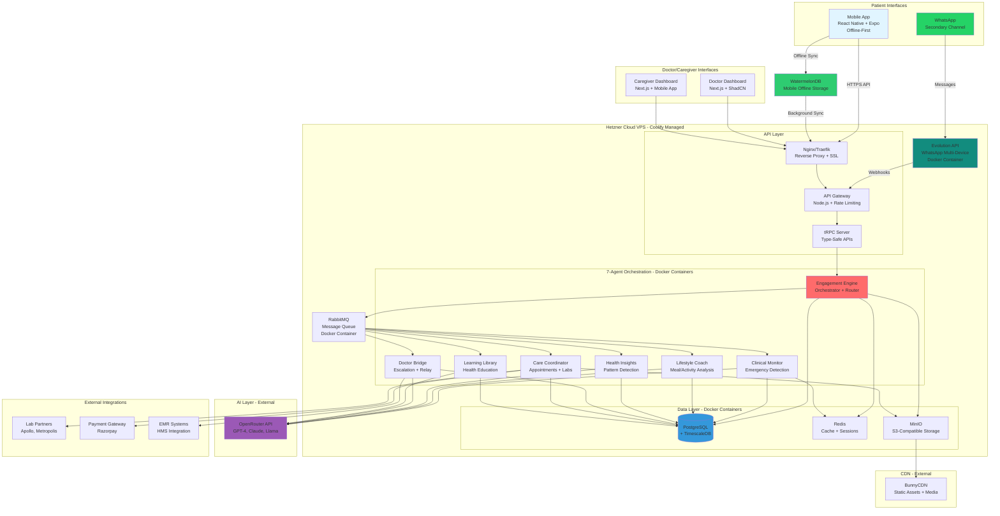

# High Level Architecture

## Technical Summary

ProCare employs a **microservices-based event-driven architecture** with offline-first mobile clients and a centralized orchestration layer. The platform combines:

- **Frontend:** React Native mobile apps (iOS/Android) with **React Native Reusables** (ShadCN for React Native) + **NativeWind** (TailwindCSS), Next.js 14 web dashboards (doctor/caregiver) with **ShadCN + TailwindCSS**, and WhatsApp Business API as secondary patient channel
- **Backend:** Node.js microservices (7 specialized AI agents) orchestrated via **RabbitMQ** message queue, with **tRPC** for type-safe API communication between web clients and backend
- **AI Layer:** **OpenRouter API** gateway for flexible access to 400+ LLMs (GPT-4, Claude, Llama), enabling cost optimization, regional compliance, and model switching without code changes
- **Data Layer:** **PostgreSQL with TimescaleDB extension** for time-series glucose data, **WatermelonDB** for offline-first mobile storage (90-day cache), **Redis** for real-time caching and session management
- **Infrastructure:** **Hetzner Cloud VPS** for self-hosted deployment, **Coolify** for Docker-based deployment automation, **MinIO** for S3-compatible object storage, **BunnyCDN** for global edge caching

This architecture achieves PRD goals: 95%+ offline availability, <2s AI response times, 500K+ users in Year 1, global extensibility, and doctor-connected care with 7-agent orchestration.

## Platform and Infrastructure Choice

**Platform: Self-Hosted on Hetzner Cloud with Coolify**

Based on infrastructure decisions, ProCare will use a **self-hosted VPS architecture** with Docker containerization, providing full control and cost efficiency.

| Service Category | Technology | Deployment Method |
|-----------------|------------|-------------------|
| **Hosting Provider** | Hetzner Cloud VPS | Munich/Helsinki data centers (GDPR-compliant) |
| **Deployment Platform** | Coolify | Docker-based deployment automation |
| **Compute** | Docker Containers | 7 agent microservices + API gateway + web apps |
| **Database** | PostgreSQL + TimescaleDB | Self-hosted in Docker via Coolify |
| **Cache** | Redis | Self-hosted in Docker via Coolify |
| **Storage** | MinIO (S3-compatible) | Self-hosted object storage for health records |
| **CDN** | BunnyCDN or Cloudflare | Edge caching for static assets |
| **Reverse Proxy** | Nginx/Traefik | Auto-configured by Coolify |
| **WhatsApp Integration** | Evolution API | Self-hosted multi-device WhatsApp API |
| **Message Queue** | RabbitMQ | Self-hosted in Docker via Coolify |
| **Monitoring** | Grafana + Prometheus | Self-hosted observability stack |
| **Auth** | Custom JWT + NextAuth.js | Self-managed authentication |

**Deployment Regions:**
- **Primary:** Hetzner Falkenstein (Germany) or Helsinki (Finland) - EU data residency
- **India Expansion:** Hetzner has no India presence yet - use BunnyCDN India edge locations for static assets, or consider Hetzner US (Ashburn) for lower latency to India
- **Consideration:** For India-specific data residency requirements, may need to add India-based VPS provider (DigitalOcean Bangalore, AWS Mumbai, or local providers) in Phase 2

**Coolify Architecture:**

Coolify will manage:
- **Apps:** Next.js dashboards, React Native API backend, 7 agent microservices
- **Databases:** PostgreSQL, Redis, RabbitMQ as one-click services
- **Deployments:** Git-based CI/CD (push to GitHub → auto-deploy)
- **SSL:** Automatic Let's Encrypt certificates
- **Networking:** Automatic Traefik reverse proxy configuration
- **Backups:** Scheduled database backups to Hetzner Object Storage or external S3

**Evolution API Integration:**

WhatsApp communication via self-hosted Evolution API:
- **Deployment:** Docker container in Coolify
- **Features:** Multi-device support, webhooks, media upload, message templates
- **Benefits:** No WhatsApp Business API approval wait (2-4 weeks), cost savings, full control
- **Architecture:** Evolution API → RabbitMQ → Engagement Engine → Agent Services

**Rationale for Self-Hosted Approach:**

**Pros:**
- **Cost Efficiency:** Hetzner VPS ~€50-200/month vs AWS ~$500-2000/month for similar resources
- **Full Control:** Complete infrastructure control, no vendor lock-in, custom configurations
- **GDPR Compliance:** Hetzner Germany/Finland data centers (critical for EU expansion)
- **Coolify DX:** Simplified deployment (Git push → auto-deploy), similar to Vercel/Heroku but self-hosted
- **Evolution API:** No WhatsApp Business API approval bottleneck, free unlimited messaging

**Cons:**
- **DevOps Responsibility:** Team manages server maintenance, security patches, scaling, backups
- **HIPAA Compliance:** Requires manual implementation (encryption, audit logs, access controls) - no BAA from Hetzner
- **India Data Residency:** No Hetzner India presence (may need multi-cloud for compliance)
- **Scaling Complexity:** Manual horizontal scaling vs AWS auto-scaling

**Risk Mitigation:**
- **India Compliance:** Verify India data protection laws allow EU hosting, or plan Phase 2 migration to India VPS
- **HIPAA-Equivalent:** Implement encryption at rest (PostgreSQL pgcrypto), TLS 1.3, audit logging, access controls
- **High Availability:** Use Hetzner multi-VPS setup with load balancing for production
- **Backups:** Automated daily backups to Hetzner Object Storage + off-site backup to AWS S3

**VPS Sizing Recommendation (Hetzner Cloud):**

**MVP/Development:**
- 1x CPX31 VPS (4 vCPU, 8GB RAM, 160GB SSD) - €13.90/month
- Runs: Coolify + PostgreSQL + Redis + RabbitMQ + All microservices + Evolution API

**Production (Year 1 - 200K paid users):**
- 1x CPX51 VPS (16 vCPU, 32GB RAM, 360GB SSD) - €54.90/month (Database + Redis)
- 2x CPX41 VPS (8 vCPU, 16GB RAM, 240GB SSD) - €28.90/month each (Microservices + API Gateway)
- 1x CPX21 VPS (3 vCPU, 4GB RAM, 80GB SSD) - €7.90/month (Coolify control plane)
- **Total:** ~€120/month vs AWS ~$1,500/month

**Database & Backup Strategy:**

**Database: PostgreSQL 16 + TimescaleDB extension (Self-Hosted on VPS)**

**PostgreSQL Configuration:**
- Deploy via Coolify (one-click PostgreSQL service)
- Enable TimescaleDB extension for glucose/vitals time-series data
- Use pgcrypto for encryption at rest (HIPAA-equivalent)
- Enable WAL (Write-Ahead Logging) for point-in-time recovery

**Backup Strategy: Multi-Tier with AWS S3**

**Tier 1 - Local Backups (Fast Recovery):**
- **Destination:** Hetzner Storage Box (same provider)
- **Frequency:** Every 6 hours
- **Retention:** 7 days of full backups
- **Tool:** pg_dump + automated cron via Coolify
- **Purpose:** Quick disaster recovery (<30 min restore)

**Tier 2 - Off-Site Backups (Disaster Recovery):**
- **Destination:** AWS S3 (ap-south-1 Mumbai or eu-central-1 Frankfurt)
- **Frequency:** Daily at 2 AM UTC
- **Retention:**
  - Daily backups: 30 days
  - Weekly backups: 12 weeks
  - Monthly backups: 12 months
- **Tool:** Restic or Borg for encrypted incremental backups
- **Cost:** ~$5-10/month for 100GB database with incremental compression
- **Purpose:** Geographic redundancy, regulatory compliance, disaster recovery

**Tier 3 - Archive (Long-Term Compliance):**
- **Destination:** AWS S3 Glacier Deep Archive
- **Frequency:** Monthly
- **Retention:** 7 years (typical healthcare data retention requirement)
- **Cost:** ~$1/month for 100GB (99% cheaper than S3 Standard)
- **Purpose:** Regulatory compliance (India, HIPAA-equivalent, GDPR)

**Continuous Backup (Point-in-Time Recovery):**
- **Method:** PostgreSQL WAL (Write-Ahead Log) archiving to AWS S3
- **Benefit:** Restore to any point in time, not just daily snapshots
- **Tool:** WAL-G or pgBackRest
- **Critical for:** Recovering from data corruption, accidental deletions

## Repository Structure

**Structure:** **Turborepo Monorepo** (recommended by 2025 research for Next.js + React Native + shared code)

**Monorepo Tool:** [Turborepo](https://turbo.build/) - Industry standard for full-stack TypeScript monorepos, optimized for Next.js + Expo, with remote caching and incremental builds

**Package Organization:**

```
procare/
├── apps/
│   ├── mobile/                  # React Native (Expo) - Patient app
│   ├── doctor-dashboard/        # Next.js 14 (App Router) - Doctor web
│   ├── caregiver-dashboard/     # Next.js 14 (App Router) - Caregiver web
│   ├── api-gateway/             # Node.js Express - API Gateway
│   └── agent-services/          # 7 AI agent microservices
│       ├── engagement-engine/   # Orchestrator
│       ├── clinical-monitor/    # Emergency detection, glucose tracking
│       ├── lifestyle-coach/     # Meal analysis, activity tracking
│       ├── health-insights/     # Pattern detection, predictions
│       ├── doctor-bridge/       # Doctor communication, escalation
│       ├── care-coordinator/    # Appointments, lab integration
│       └── learning-library/    # Health education content
├── packages/
│   ├── shared/                  # Shared types, utilities, constants
│   ├── ui/                      # ShadCN components (web)
│   ├── ui-native/               # React Native Reusables (mobile)
│   ├── database/                # Prisma schema, migrations, client
│   ├── openrouter-client/       # OpenRouter API SDK wrapper
│   ├── whatsapp-client/         # WhatsApp Business API SDK wrapper
│   └── config/                  # ESLint, TypeScript, Jest configs
└── infrastructure/              # Terraform/CDK for AWS resources
```

**Code Sharing Strategy:**
- **Types:** All TypeScript interfaces in `packages/shared/types` (Patient, Doctor, GlucoseReading, etc.)
- **UI Components:** ShadCN (web) in `packages/ui`, React Native Reusables (mobile) in `packages/ui-native` - shared design system
- **Business Logic:** Shared utilities in `packages/shared/utils` (date formatting, validation, pattern detection algorithms)
- **Database:** Single Prisma schema in `packages/database` used by all backend services
- **API Contracts:** tRPC routers defined once, consumed by web dashboards and mobile app

**Rationale:**
- Turborepo chosen based on 2025 research showing it's the industry standard for Next.js + React Native monorepos (used by Vercel, Shopify)
- Monorepo enables atomic commits across mobile + web + backend when shared types change
- Remote caching speeds up CI/CD (Turborepo caches build outputs across machines)
- Alternative considered: NX (more powerful but steeper learning curve, overkill for our needs)

## High Level Architecture Diagram



## Architectural Patterns

Based on PRD requirements and 2025 best practices, ProCare implements the following patterns:

- **Event-Driven Microservices:** Agents communicate via RabbitMQ events (patient action → Engagement Engine → route to agents → synthesize response). _Rationale:_ Loose coupling enables independent agent evolution, fault isolation, and horizontal scaling. Critical for 7-agent orchestration (NFR3: 1,000+ concurrent users).

- **Offline-First Architecture (Mobile):** Local-first data storage with event sourcing and background sync. _Rationale:_ Addresses intermittent connectivity in India (NFR1: 95% <24hr stale data). WatermelonDB chosen for React Native optimized performance (research-backed).

- **API Gateway Pattern:** Single entry point (Traefik + API Gateway) for rate limiting, authentication, routing. _Rationale:_ Centralized security, enforces FR15 (max 5 notifications/day), simplifies client integration.

- **Backend for Frontend (BFF):** Separate tRPC routers for doctor dashboard, caregiver dashboard, mobile app. _Rationale:_ Each interface has different data needs (doctors: tiered patient view, caregivers: alerts + digest, patients: chat + logging).

- **Repository Pattern:** Abstract database access behind repository interfaces. _Rationale:_ Enables testing without database, future migration flexibility (e.g., switch from PostgreSQL to distributed database).

- **CQRS (Command Query Responsibility Segregation):** Separate read models (doctor dashboard queries) from write models (patient data logging). _Rationale:_ Optimizes NFR2 (500ms dashboard load) by using read-optimized views and caching.

- **Saga Pattern (for distributed transactions):** Multi-step workflows (e.g., appointment booking → payment → calendar update → doctor notification) managed as compensating transactions. _Rationale:_ Ensures data consistency across microservices without distributed locks.

- **Circuit Breaker Pattern:** Protect against cascading failures when external APIs fail (OpenRouter, WhatsApp, Lab Partners). _Rationale:_ Healthcare app requires high availability - if OpenRouter is down, gracefully degrade AI responses rather than crash.

- **Strangler Fig Pattern (for future migration):** Gradually replace monolithic AI calls with specialized agent calls. _Rationale:_ Allows iterative migration from single LLM to 7-agent orchestration without big-bang rewrite.

- **Component-Based UI (React/React Native):** Reusable UI components with ShadCN (web) and React Native Reusables (mobile). _Rationale:_ Consistency across interfaces, faster development, leverages 2025 industry-standard component libraries.

---
